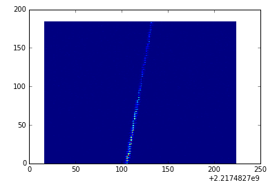
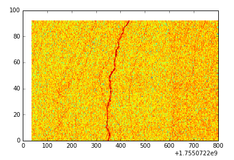
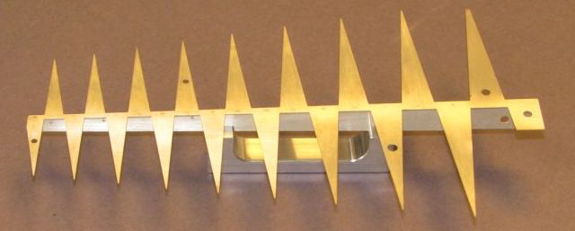

# SETI Institute Hackathon and Code Challenge
#### Machine Learning 4 the Search for Extra Terrestrial Intelligence (http://www.seti.org/ml4seti)

The SETI Institute is hosting a public hackathon and global, online code challenge to find a robust signal classification algorithm for use in our mission to find E.T. radio communication. By framing the radio signal data as spectrogram (a 2D visual representation), we can convert the problem into something akin to an image classification problem.  We are looking for participants to build machine learning and deep learnng / AI techniques to construct highly accurate classification systems that will be used in our data analysis pipeline at our telescope array. 

## Introduction

This page documents the details for the SETI Institute's Hackathon (June 10-11, 2017) and code challenge (June 1 to July 31, 2017), 
as generally described on our main page, http://www.seti.org/ml4seti

## Contents

  * [Project Details](#project-details)
  * [Event Details & Registration](#event-details--registration)
      * [Hackathon Schedule](#hackathon-schedule)
  * [Awards & Prizes](#awards--prizes)
      * [Trophies!](#trophies)
  * [Teamwork](#teamwork)
      * [Click here to up for Slack Team](https://ml4seti.mybluemix.net)
  * [Licensing](#licensing)
  * [FAQ](#frequently-asked-questions)
  * [Other Reading](#other-reading)

## Project Details

Each night, using the Allen Telescope Array (ATA) in northern California, we scan the sky at 
various radio frequencies, observing star systems with known exoplanets, searching for faint but persistent signals. 
The current signal detection system is programmed to search only for particular kinds of signals: narrow-band 
carrier waves. However, the detection system sometimes triggers on signals that are not narrow-band signals 
(with unknown efficiency) and are also not explicitly-known radio frequency interference (RFI). 
There seems to be various categories of these kinds of events that have been observed in the past. 

Our goal is to classify these accurately in 
real-time. This would allow the signal detection system to make better informed observational decisions, 
increase the efficiency of the nightly scans, and allow for explicit detection of these other signal types. 

The standard approach to SETI signal detection and classification is to transform the observed radio signals, which
are time-series data, into a 
2-dimensional representation called a spectrogram. A spectrogram is a measure of the power of the signal across 
a range of frequencies, as a function of time. From this, our software searches for narrow-band signals. 
One can also think of a spectogram as a 2D image and transform the 
problem into a visual recognition problem. This is likely to be the primary approach for most solutions, 
though other methods are certainly possible. 

For example, here is a classic narrow-band signal observered from the 
[ISEE3 explorer](https://en.wikipedia.org/wiki/International_Cometary_Explorer). These are the kinds of
signals our software is tuned to identify.

But things are never that pretty unless we're looking at a spacecraft. Here's another example: 
a mysterious squiggle observed in 2014 (the color scale is different because the power amplitude, coming out of the
page is on a log-scale). 

 

Similar to the signal above, we often see various signal types that our software is not specifically 
designed to detect. These have various names like "squiggles", "pulsed", and 
"bright pixels".

We want to build classification models that are designed to find these "other" types of signals, which is what
this hackathon and code challenge is all about. 
We hope to utilize the expertise from the data science community and simultaneously allow a way for 
citizen scientists to get involved in research that is normally out of their reach.  We want to increase the number of large cups in the water, as [Dr. Jill Tarter](http://www.seti.org/users/jill-tarter) might [describe it](https://www.ted.com/talks/jill_tarter_s_call_to_join_the_seti_search). 

If you have participated in the SETI@IBMCloud project 
([blog post](https://developer.ibm.com/clouddataservices/2016/09/29/seti-data-on-ibm-cloud/), 
[github repo](https://github.com/ibm-cds-labs/seti_at_ibm)), these spectrogram should be familiar to you. 

### The Hackathon & Code Challenge
 
The code challenge will ask participants to build a classification system based on a large body of simulated 
data that we are now constructing. You will receive the raw data for hundreds of thousands of signals, 
like the ones you see above. The most accurate classifier submitted by the end of the code challenge will be installed into the SETI Institute's data analysis pipeline to work on the latest observational data. 
 
 
#### The Hackathon 

The hackathon will be a mini-version of the code challenge, with its own set of prizes; an event 
entirely within itself that you can participate in. However, it will also be a kick-off for the larger 
code challenge. 

##### Special Offers to Attendees

We are excited to offer significant computing resources for participants of the hackathon.

Attendees will receive

  * weekend access to [IBM Watson Visual Recognition](https://www.ibm.com/watson/developercloud/visual-recognition.htmlv)
  * weekend access to an [IBM Apache Spark Enterprise cluster](https://www.ibm.com/analytics/us/en/technology/spark/) 
  * weekend access to [IBM PowerAI Deep Learning](https://www.ibm.com/us-en/marketplace/deep-learning-platform) platform on [Nimbix Cloud](https://www.nimbix.net/) 
  * tutorials covering IBM Watson VR, Tensorflow, and [Skymind's DL4J](https://skymind.ai)
  * extended trial account on [IBM Bluemix](https://bluemix.net)  
  * extended trial account on [IBM Data Science Experience](https://datascience.ibm.com)

 
You’ll work directly with top SETI researchers. There will be talks by [Dr. Jill Tarter](https://www.ted.com/talks/jill_tarter_s_call_to_join_the_seti_search) and [Dr. Gerry Harp](https://www.seti.org/users/gerry-harp) from the SETI Institute and [Dr. Danny Price](https://seti.berkeley.edu/people/Danny.html) of UC Berkeley / [Breakthrough Listen](https://breakthroughinitiatives.org/).

The hackathon will be at the **new IBM Innovation Space**, which occupies the 5th floor of the SOMA Galvanize office in San Francisco. In addition, we will also have access to the **Galvanize rooftop** for getting some fresh air and  breaks. A light breakfast, snacks, lunch for both days and a pizza dinner on Saturday evening will be provided. 

## Event Details & Registration

We have two separate pages for registration. 

 

### Hackathon Schedule

  * Saturday, June 10, 2017
    * 8:00 - 9:00    Breakfast
    * 9:00 - 10:00   Introduction, Team forming
    * 10:00 - 12:00  Hack
    * 12:00 - 1:00   Lunch + Talk by [Dr. Jill Tarter](http://www.seti.org/users/jill-tarter) and [Dr. Gerry Harp](http://www.seti.org/seti-institute/staff/gerry-harp) of the SETI Institute
    * 1:00 - 10:00   Hack + Power AI Workshop (1:00pm) + Pizza (6:30pm)

  * Sunday, June 11, 2017
    * 8:00 - 9:00    Breakfast
    * 9:00 - 2:00    Hack + Lunch
    * 2:30 - 3:00    Talk by [Dr. Danny Price](https://seti.berkeley.edu/people/Danny.html) of the [UC Berekeley SETI Research Center](https://seti.berkeley.edu/index.html)
    * 3:00 - 3:30    Break
    * 3:30 - 5:45    Presentations + Awards

## Awards & Prizes

We are excited to be able to offer some amazing and extremely unique prizes.
You will not find prizes like this anywhere else.

**The SETI Institute reserves the right to alter the awards and prizes at any time. 
Of course, we will do our best, but cannot make any guarantees.**

### Code Challenge

The prize for the best classifier submitted by the end of the code-challenge will be:

  * Installation of code at ATA data acquisition pipeline.
  * Co-authorship with SETI Institute researchers on a paper to be submitted in a peer-reviewed scientific journal
  * Assistance presenting work at a SETI research conference or meetup. 

### Hackathon Awards

At the end of the hackathon, the judging panel will listen to brief presentations by participating teams
and offer awards on the

  * Best Classification 
    * Winner gets a tour of the ATA with SETI Institute scientists (up to 6 team members).
  * Best Signal Processing
  * Best Classifier without a Neural Network or IBM Watson
  * Most Interesting / Surprising Analysis

We are working on more awards and prizes for both the hackathon and code challenge.   

#### Trophies!

Dr. Gerry Harp and one of his friends have managed to cut apart some old antenna and fashion them into 
trophies that will be handed out as awards at the hackathon.

### Code Challenge Judging

We are planning to judge the main code challenge entries by the following metrics

  * Log-Loss function based on confusion matrix results
  * Speed of single-event classification (We have a very weak speed requirement of classification within 30 seconds, which allows for cloud-based solutions.)

Before the code challenge, we will have a better definition of how you will submit your entry.

## Teamwork

You will mostly likely need to form a team of 4 to 6 people in order to accomplish your goals in a 
timely manner. To facilitate team-building, among other things, we have created a Slack team for 
communication.  

[Sign up for the Slack team here.](https://ml4seti.mybluemix.net)

### Analysis Ideas

List of analysis ideas and concepts that may be useful:

  * "standard" machine-learning feature extraction (see [`ibmseti`](https://github.com/ibm-cds-labs/ibmseti))
  * Watson Visual Recognition
  * Deep Learning (CNN)
    * on fourier-space representation 
    * on raw time-series
    * [Basic Deep Learning tutorial](https://apsportal.ibm.com/exchange/public/entry/view/efb51900cc9d687fb9f05b2eabb66cb5)
  * [Deep Forest](https://arxiv.org/abs/1702.08835)
  * Priciple Component Analysis
  * Decision Trees
  * Support Vector Machines
  * k-Nearest Neighbors
  * Wavelet decomposition
  * De-chirping
  * KTL transform
  * Time-series preprocessing: windowing, or Welch periodigram estimation

If you wish you contribute a separate idea to this list you can

  * issue a Pull Request to this repo
  * talk to an organizer on our Slack team (`@gadamc` or `@gerryharp`)

## Licensing

In order to participate in the code challenge and hackathon, your code must be open-source and licenced under 
the Apache License 2.0. 

## Frequently Asked Questions

**Can I participate in the hackathon remotely?**

All material and information that you will need to do the work will be available online. You
can participate with teams at the hackathon (and communicate with your team via Slack). 
However, we cannot ship any prizes or event swag to participants that are 
remote and we cannot support presentations of work for remote teams. At least one team member must be at
the hackathon in order to present your work and win a prize. 

## Other Reading

The SETI Institute has been partnering with IBM for almost two years now. We've done amazing work together and 
have written about it in various places. Please check it out.

  * [SETI Talk at Seattle Galvanize by Adam Cox](img/SEA_Galvanize.pdf)
  * [SETI@IBMCloud: SETI data, publicly available, from IBM](https://developer.ibm.com/clouddataservicesold/2016/09/29/seti-data-on-ibm-cloud/)
  * [SETI sparks Machine Learning to sift Big Data](http://blog.ibmjstart.net/2015/07/14/seti-sparks-machine-learning-to-sift-big-data/)
  * [Types of Big Data from the Allen Telescope Array](http://blog.ibmjstart.net/2015/08/06/types-of-bigdata-from-the-allen-telescope-array/)
  * [Signal Classification: Powerful Patterns from Simple Features](http://blog.ibmjstart.net/2015/11/10/signal-classification-powerful-patterns-from-simple-features/)
  * [IBM and Stanford University team up for a new perspective on SETI signal analysis](http://blog.ibmjstart.net/2016/06/29/ibm-stanford-university-team-new-perspective-seti-signal-analytics/)
  * [Status Update from the SETI Institute](https://developer.ibm.com/clouddataservicesold/2016/03/07/status-update-from-the-seti-institute/)
  * [The SETI Project Team](http://blog.ibmjstart.net/2016/10/25/draft-seti-project-team/)

