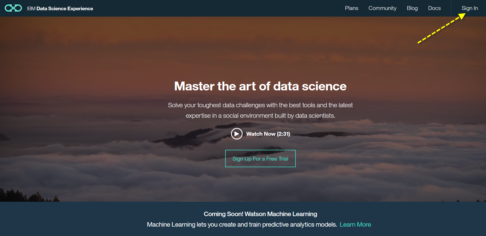
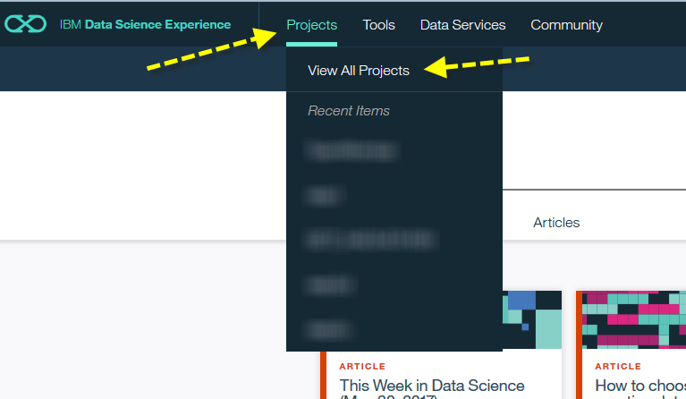
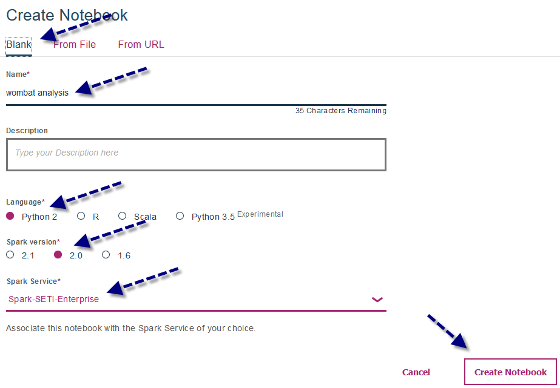
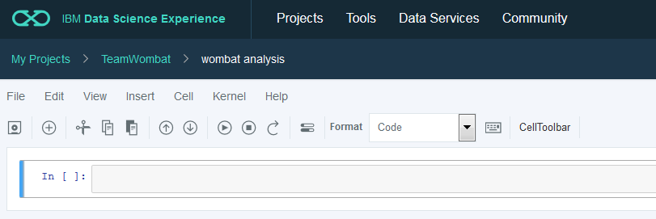
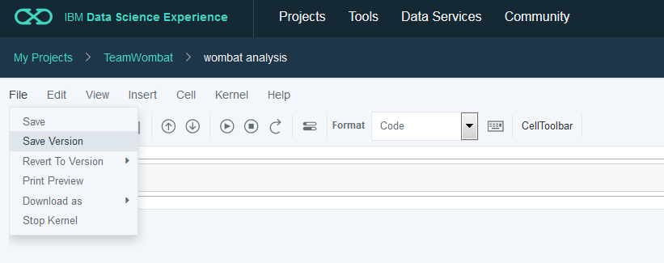
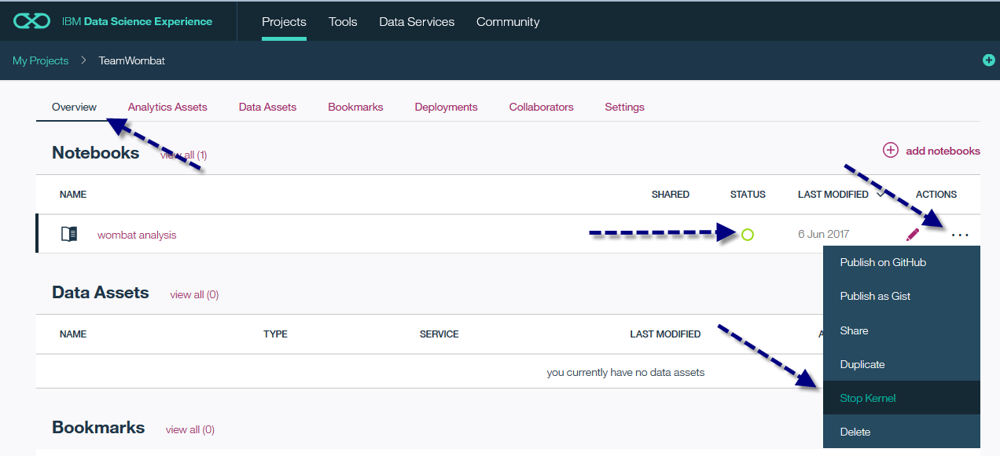
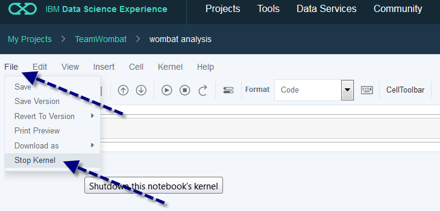
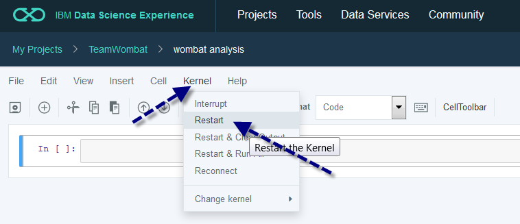
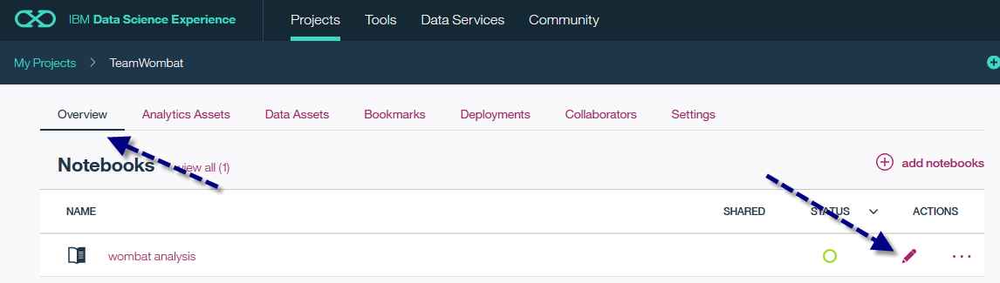

### Creating your first project notebook

1. Direct your browser to https://datascience.ibm.com/ and log in using the email address you've provided in your team sign-up sheet.

   

2. Select **Projects** > **View All Projects**

   

3. Click on the project named after our team. _Contact the event staff if you cannot see the project._ 

   

4. This project is empty by default. Create a new notebook by clicking **add notebooks**.

   

5. Select **Blank**, type in a notebook name and make sure **Python 2**, **Spark 2.0** and **Spark-SETI-Enterprise** are selected. Click **Create Notebook**.
  
> You may also select "From URL" and then paste in the GitHub "Raw" URL of an example Notebook in this repository

   

6. The notebook opens and a Spark kernel is automatically started.

   

   > Because event resources are limited you may only utilize one Enterprise Spark kernel during the event. You can create as many notebooks in Data Science Experience as you wish but must never run more than one notebook at a time. Each notebook is associated with a kernel and will remain running until you explicitly shut down the kernel. 
   
### Saving the notebook

Notebooks are perioodically saved. However, to avoid losing any changes manually save changes by selecting **File** > **Save**.

   

### Checking the Spark kernel status

You can view the Spark kernel status in the project overview.

   

### Stopping the Spark kernel

* You can stop a running kernel in the project overview by selecting **…** > **Stop Kernel**.

   

* To stop a kernel while the notebook is open select **File** > **Stop Kernel**.

   

### Restarting the Spark kernel

To restart a kernel while the notebook is open select **Kernel** > **Restart**.

   

### Re-opening a notebook

To re-open a notebook open the project overview and click the pencil icon.

   
