### Using tutorial notebooks in DSX

1. Direct your browser to https://datascience.ibm.com/ and log in (or sign up)

   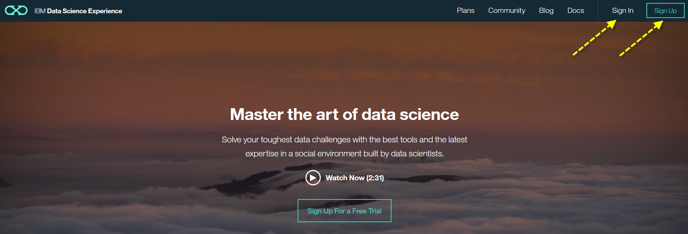

2. Select **Projects** > **View All Projects**

   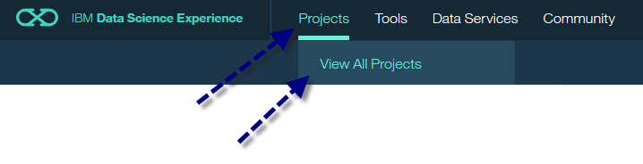

3. Click **create project**. The _New Project_ wizard opens.

   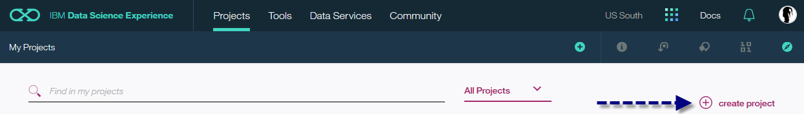

4. Enter a project name, select **DSX-Spark** as _Spark Service_, **Object Storage** as _Storage Type_ and **DSX-ObjectStorage** as _Object Storage Instance_. Click **Create**.

   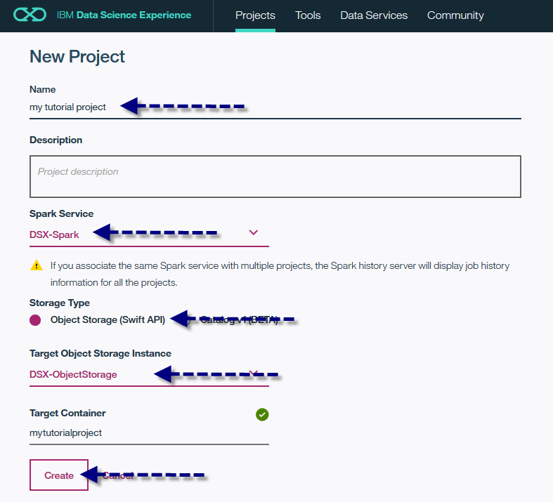

5. This new project is empty by default. Create a new notebook by clicking **add notebooks** in the project _Overview_ tab.

   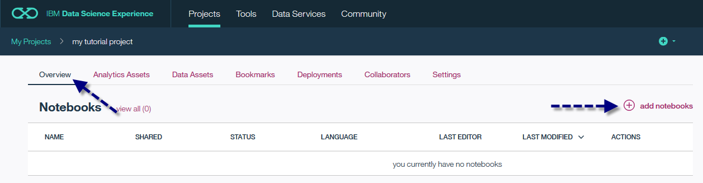

6. In the _Create Notebook_ wizard select **From URL**, type in a notebook _name_, enter the _URL_ of the notebook you want to load and select **DSX-Spark** as _Spark Service_. Click **Create Notebook**.

   
   
   > When creating a notebook from a GitHub URL specify the raw URL. 

7. The notebook opens and a Spark kernel is automatically started.

   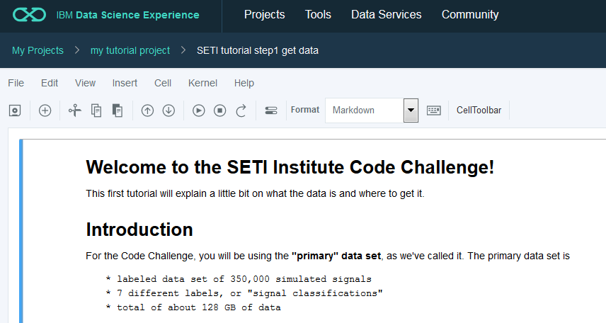

   >  In Data Science Experience each notebook is associated with a kernel. This kernel will remain running until you explicitly shut down the kernel. 
   
### Saving the notebook

Notebooks are periodically saved. However, to avoid loosing any changes manually save changes by selecting **File** > **Save**.

   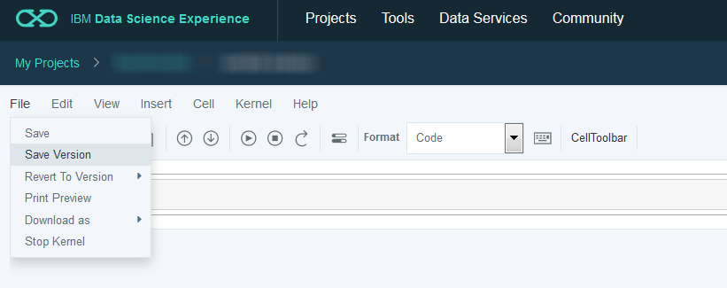

### Checking the Spark kernel status

You can view the Spark kernel status and the project overview.

   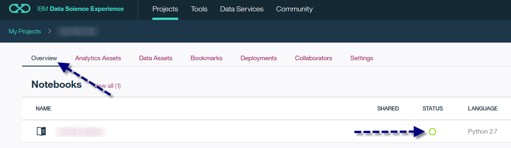

### Stopping the Spark kernel

* You can stop a running kernel in the project overview by selecting **…** > **Stop Kernel**.

   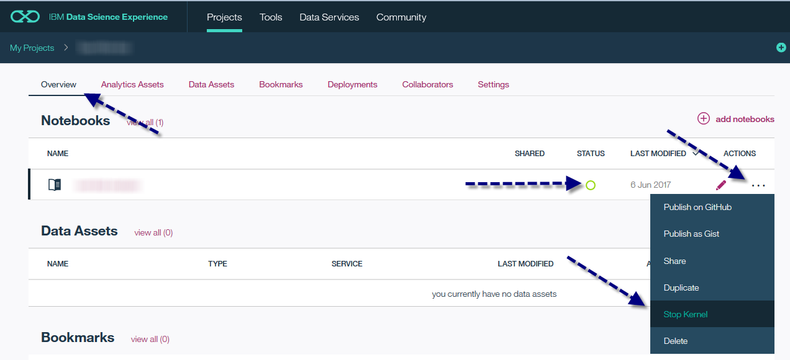

* To stop a kernel while the notebook is open select **File** > **Stop Kernel**.

   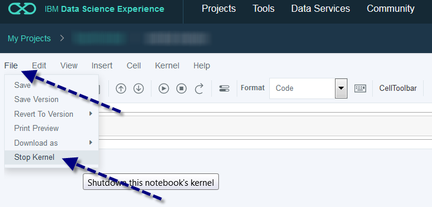

### Restarting the Spark kernel

To restart a kernel while the notebook is open select **Kernel** > **Restart**.

   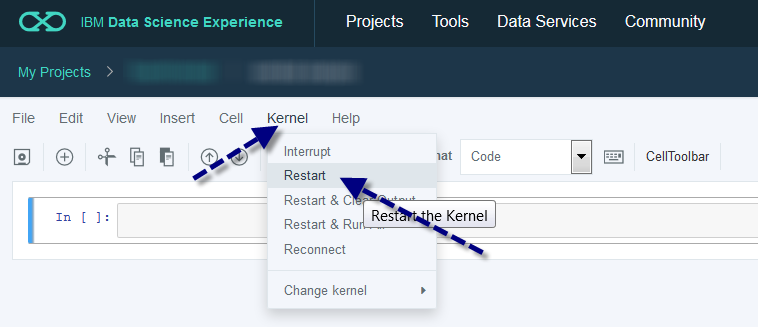

### Re-opening a notebook

To re-open a notebook open the project overview and click the pencil icon.

   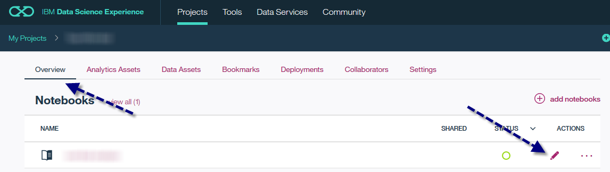
